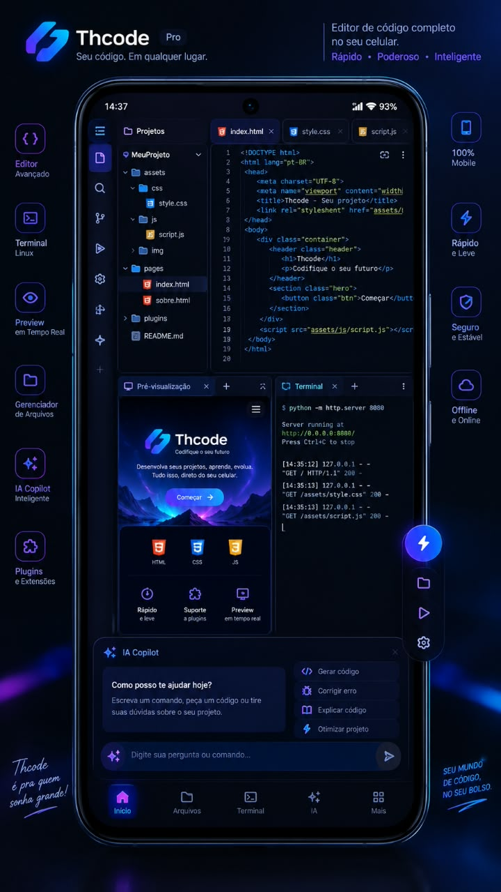

# Thcode — IDE mobile real (frontend PWA + backend)

Frontend: https://rlkbiloga-coder.github.io/Thcode/ (PWA, offline, funciona sem backend em modo local)
Backend: terminal PTY real, filesystem real, execução real, Git real, GitHub real, SFTP real, IA real.

## Estrutura

```
frontend/   PWA (HTML/CSS/JS puro) — editor, VFS local (localStorage), terminal local honesto
backend/    API REST + WebSocket reais (Node 18+, Express, ws, node-pty, ssh2)
docs/       ARCHITECTURE, SECURITY, API, DEPLOY, PLUGIN
Dockerfile  backend em contêiner
docker-compose.yml  backend + frontend nginx
```



## Regra de honestidade

Se um recurso exige backend/runtime e ele não está conectado, o Thcode mostra
"não disponível" — nunca simula sucesso. Comandos locais falsos (apk/npm/node/python
sem backend) respondem com o motivo real e como habilitar.

## Backend em 60 segundos

```bash
cd backend
cp .env.example .env
# edite .env: THCODE_API_TOKEN (gere com o comando do arquivo), GITHUB_TOKEN, GROQ_API_KEY etc.
npm install
npm start          # http://localhost:8080
npm test           # 19 testes de integração reais (fs, git, run, WS, segurança)
```

No app: painel *Servidor* → Conectar → URL + token. A partir daí:

* Terminal REAL (xterm.js + WebSocket + PTY node-pty)
* Execução real de .js/.py/.sh (verifica runtime antes; "Runtime não instalado" se faltar)
* Git real (init/status/commit/clone/push/pull/diff/log)
* GitHub real (token no backend; sem token → 503 honesto)
* SFTP/SSH real (erros reais: Connection refused, Authentication failed…)
* IA real (chaves só no .env do backend)

## Docker

```bash
THCODE_API_TOKEN=<token> docker compose up -d
# frontend: http://localhost:3000 | backend: http://localhost:8080
```

## Deploy rápido do backend
[](https://railway.app/new/github?repo=https%3A%2F%2Fgithub.com%2Frlkbiloga-coder%2FThcode&rootDir=backend)

Render: New → Blueprint (usa render.yaml) • Fly: `fly launch` (usa fly.toml) • Docker: `docker compose up -d`

## Deploy

Ver docs/DEPLOY.md (Railway, Render, Fly.io, VPS). O frontend vai pro GitHub Pages
via workflow (.github/workflows/pages.yml) — sem fingir backend no Pages.

## APK Android

PWA instalável direto do navegador (Adicionar à tela inicial). Para APK:
abra https://www.pwabuilder.com → cole a URL do site → Package for Stores → Android.
(docs/DEPLOY.md tem o passo a passo completo.)
